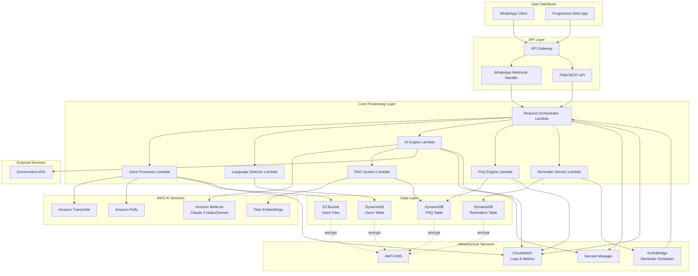
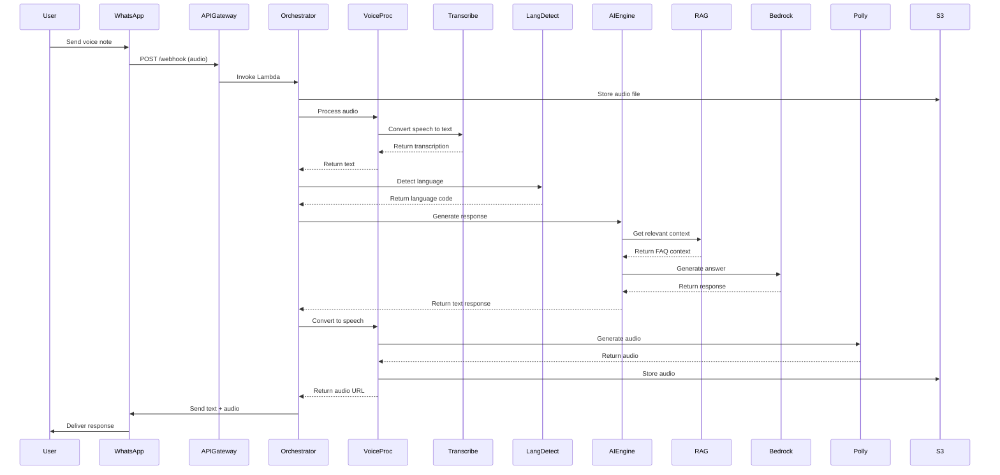
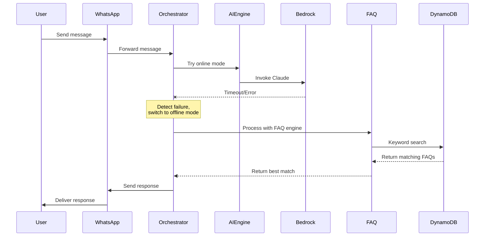

# Technical Design Document: Maitri AI Voice Assistant

## Overview

Maitri AI is a serverless, multilingual voice and text AI assistant built on AWS infrastructure, designed specifically for users in Bharat (India). The system provides voice-first interaction through WhatsApp and a Progressive Web Application (PWA), with automatic language detection supporting 10 Indian languages. The architecture leverages Amazon Bedrock for AI reasoning, Amazon Transcribe for speech-to-text, Amazon Polly for text-to-speech, and implements a hybrid online/offline mode to ensure accessibility in low-bandwidth rural areas.

The system is designed with the following key principles:

- Serverless architecture for automatic scaling and cost optimization
- Voice-first interaction optimized for low-literacy users
- Multilingual support with automatic language detection
- Hybrid online/offline mode for reliability in poor connectivity areas
- Security and privacy compliance with Indian data protection regulations
- Low-bandwidth optimization for rural accessibility

### Key Design Decisions

1. **Serverless Architecture**: Using AWS Lambda, API Gateway, and managed services eliminates infrastructure management and provides automatic scaling
2. **Hybrid Mode Strategy**: Online mode uses Bedrock for intelligent responses; offline mode uses local FAQ matching for reliability
3. **WhatsApp as Primary Interface**: Leverages existing user familiarity and widespread adoption in rural India
4. **RAG-Based Context Retrieval**: Semantic search using Titan Embeddings provides relevant context for accurate responses
5. **Voice-First Design**: Prioritizes audio interaction to support users with limited literacy
6. **DynamoDB for State Management**: Provides low-latency access to user profiles, FAQs, and reminders with automatic scaling

## Architecture

### High-Level System Architecture



### Request Flow Diagrams

#### Voice Message Flow (Online Mode)



#### Offline Mode Fallback Flow



## Components and Interfaces

### 1. WhatsApp Gateway

The WhatsApp Gateway handles all communication with the WhatsApp Business API.

**Responsibilities:**
- Receive incoming messages (text and voice) via webhook
- Validate webhook signatures for security
- Send outgoing messages (text and audio)
- Handle delivery status callbacks
- Implement retry logic for failed deliveries

**Interface:**

```typescript
interface WhatsAppGateway {
  // Webhook handler for incoming messages
  handleIncomingMessage(request: WebhookRequest): Promise<void>;
  
  // Send text message
  sendTextMessage(phoneNumber: string, text: string): Promise<SendResult>;
  
  // Send audio message
  sendAudioMessage(phoneNumber: string, audioUrl: string): Promise<SendResult>;
  
  // Verify webhook signature
  verifySignature(payload: string, signature: string): boolean;
}

interface WebhookRequest {
  from: string;           // Phone number
  messageId: string;
  timestamp: number;
  type: 'text' | 'audio';
  content: string | AudioContent;
}

interface AudioContent {
  mimeType: string;
  url: string;
  size: number;
}

interface SendResult {
  success: boolean;
  messageId?: string;
  error?: string;
}
```

**AWS Resources:**
- API Gateway REST API with `/webhook` endpoint
- Lambda function: `whatsapp-webhook-handler`
- IAM role with permissions for Lambda, S3, and Secrets Manager

### 2. Voice Processor

Handles all speech-to-text and text-to-speech operations.

**Responsibilities:**
- Download audio files from WhatsApp
- Invoke Amazon Transcribe for speech-to-text
- Invoke Amazon Polly for text-to-speech
- Store and manage audio files in S3
- Handle transcription retries and errors
- Clean up expired audio files

**Interface:**

```typescript
interface VoiceProcessor {
  // Convert speech to text
  transcribeAudio(audioUrl: string, languageCode: string): Promise<TranscriptionResult>;
  
  // Convert text to speech
  synthesizeSpeech(text: string, languageCode: string): Promise<AudioResult>;
  
  // Clean up old audio files
  cleanupExpiredFiles(): Promise<void>;
}

interface TranscriptionResult {
  text: string;
  confidence: number;
  languageCode: string;
  timestamp: number;
}

interface AudioResult {
  audioUrl: string;
  duration: number;
  format: string;
  expiresAt: number;
}
```

**AWS Resources:**
- Lambda function: `voice-processor`
- S3 bucket: `maitri-voice-files` with lifecycle policies
- IAM role with permissions for Transcribe, Polly, and S3

**Configuration:**
- Supported audio formats: OGG, MP3, AAC
- Maximum file size: 16MB
- Audio retention: 24 hours for input, 48 hours for output
- Transcribe retry: 2 attempts with exponential backoff
- Polly output format: OGG at 64 kbps

### 3. Language Detector

Identifies the language of user input and manages language preferences.

**Responsibilities:**
- Detect language from text with confidence scoring
- Retrieve user language preferences from User_Store
- Update user preferences based on usage patterns
- Support 10 Indian languages

**Interface:**

```typescript
interface LanguageDetector {
  // Detect language from text
  detectLanguage(text: string, userId: string): Promise<LanguageResult>;
  
  // Update user language preference
  updateUserLanguage(userId: string, languageCode: string): Promise<void>;
}

interface LanguageResult {
  languageCode: string;  // ISO 639-1 code
  confidence: number;    // 0.0 to 1.0
  source: 'detected' | 'preference' | 'default';
}
```

**Supported Languages:**
- Hindi (hi)
- English (en)
- Tamil (ta)
- Telugu (te)
- Bengali (bn)
- Marathi (mr)
- Gujarati (gu)
- Kannada (kn)
- Malayalam (ml)
- Punjabi (pa)

**AWS Resources:**
- Lambda function: `language-detector`
- DynamoDB table: `Users` (read/write access)

**Detection Logic:**
1. Analyze text using character set and common word patterns
2. If confidence >= 85%, use detected language
3. If confidence < 85%, check user's preferred language in User_Store
4. If no preference exists, default to Hindi
5. Track language usage; update preference after 3 consecutive uses

### 4. AI Engine

Orchestrates AI-powered response generation using Amazon Bedrock.

**Responsibilities:**
- Invoke RAG system for context retrieval
- Select appropriate Claude model (Haiku vs Sonnet)
- Generate responses using Bedrock
- Query Government APIs for real-time data
- Handle fallback to offline mode on failures
- Implement circuit breaker pattern

**Interface:**

```typescript
interface AIEngine {
  // Generate AI response
  generateResponse(request: AIRequest): Promise<AIResponse>;
  
  // Check if online mode is available
  isOnlineAvailable(): boolean;
}

interface AIRequest {
  userInput: string;
  languageCode: string;
  userId: string;
  conversationHistory?: Message[];
}

interface AIResponse {
  text: string;
  mode: 'online' | 'offline';
  confidence: number;
  sources?: string[];
  processingTime: number;
}

interface Message {
  role: 'user' | 'assistant';
  content: string;
  timestamp: number;
}
```

**AWS Resources:**
- Lambda function: `ai-engine`
- Amazon Bedrock access (Claude 3 Haiku and Sonnet)
- Secrets Manager for Government API credentials
- CloudWatch for circuit breaker state

**Model Selection Logic:**
- Use Claude 3 Haiku for:
  - Simple factual queries
  - FAQ-style questions
  - Quick information retrieval
- Use Claude 3 Sonnet for:
  - Complex reasoning tasks
  - Multi-step problem solving
  - Eligibility calculations
  - Personalized recommendations

**Circuit Breaker Configuration:**
- Failure threshold: 50% over 1-minute window
- Open state duration: 30 seconds
- Half-open test requests: 3

### 5. RAG System

Implements Retrieval-Augmented Generation using semantic search.

**Responsibilities:**
- Generate embeddings for user queries
- Perform semantic search against FAQ database
- Cache frequently accessed embeddings
- Return relevant context for AI Engine

**Interface:**

```typescript
interface RAGSystem {
  // Retrieve relevant context
  retrieveContext(query: string, languageCode: string): Promise<ContextResult>;
  
  // Generate embedding for text
  generateEmbedding(text: string): Promise<number[]>;
  
  // Search FAQ database
  semanticSearch(embedding: number[], limit: number): Promise<FAQEntry[]>;
}

interface ContextResult {
  entries: FAQEntry[];
  relevanceScores: number[];
  retrievalTime: number;
}

interface FAQEntry {
  id: string;
  question: string;
  answer: string;
  languageCode: string;
  category: string;
  embedding: number[];
  metadata: Record<string, any>;
}
```

**AWS Resources:**
- Lambda function: `rag-system`
- Amazon Titan Embeddings model
- DynamoDB table: `FAQ` with vector search capability
- ElastiCache (optional) for embedding caching

**Configuration:**
- Embedding dimension: 1536 (Titan default)
- Similarity threshold: 0.7
- Maximum results: 5
- Cache TTL: 1 hour
- Similarity metric: Cosine similarity

### 6. FAQ Engine

Provides offline fallback using keyword-based search.

**Responsibilities:**
- Perform keyword matching against FAQ database
- Calculate keyword overlap scores
- Return best matching FAQ entries
- Support all 10 languages
- Provide default responses when no match found

**Interface:**

```typescript
interface FAQEngine {
  // Search FAQs using keywords
  searchFAQs(query: string, languageCode: string): Promise<FAQSearchResult>;
  
  // Get default response for no match
  getDefaultResponse(languageCode: string): string;
}

interface FAQSearchResult {
  match: FAQEntry | null;
  score: number;
  searchTime: number;
}
```

**AWS Resources:**
- Lambda function: `faq-engine`
- DynamoDB table: `FAQ` (read-only access)

**Keyword Matching Algorithm:**
1. Tokenize user query and FAQ questions
2. Remove stop words for the detected language
3. Calculate keyword overlap percentage
4. Return FAQ with highest overlap if >= 70%
5. If no match >= 70%, return default response

### 7. Reminder Service

Manages reminder creation, storage, and delivery.

**Responsibilities:**
- Parse reminder requests from user input
- Extract datetime and reminder text
- Store reminders in DynamoDB
- Schedule reminders using EventBridge
- Deliver reminders via WhatsApp Gateway
- Handle reminder cancellations

**Interface:**

```typescript
interface ReminderService {
  // Create a new reminder
  createReminder(request: ReminderRequest): Promise<ReminderResult>;
  
  // Cancel a reminder
  cancelReminder(reminderId: string, userId: string): Promise<boolean>;
  
  // List user reminders
  listReminders(userId: string): Promise<Reminder[]>;
  
  // Trigger reminder delivery (called by EventBridge)
  deliverReminder(reminderId: string): Promise<void>;
}

interface ReminderRequest {
  userId: string;
  phoneNumber: string;
  reminderText: string;
  scheduledTime: number;  // Unix timestamp
  languageCode: string;
}

interface ReminderResult {
  reminderId: string;
  scheduledTime: number;
  success: boolean;
  error?: string;
}

interface Reminder {
  reminderId: string;
  userId: string;
  phoneNumber: string;
  reminderText: string;
  scheduledTime: number;
  createdAt: number;
  status: 'pending' | 'delivered' | 'cancelled';
  languageCode: string;
}
```

**AWS Resources:**
- Lambda function: `reminder-service`
- DynamoDB table: `Reminders`
- EventBridge rules (dynamically created per reminder)
- IAM role with EventBridge permissions

**Datetime Parsing:**
- Support natural language: "tomorrow at 3pm", "next Monday", "in 2 days"
- Support absolute dates: "15th August 2024"
- Support relative times: "in 3 hours", "after 2 weeks"
- Maximum future date: 1 year from creation

### 8. Request Orchestrator

Central coordinator that manages the request lifecycle.

**Responsibilities:**
- Route incoming requests to appropriate services
- Coordinate multi-step processing workflows
- Implement timeout and retry logic
- Handle mode switching (online to offline)
- Aggregate responses and send to users
- Track request metrics

**Interface:**

```typescript
interface RequestOrchestrator {
  // Process incoming request
  processRequest(request: IncomingRequest): Promise<void>;
  
  // Handle reminder delivery
  handleReminderDelivery(reminderId: string): Promise<void>;
}

interface IncomingRequest {
  requestId: string;
  userId: string;
  phoneNumber: string;
  type: 'text' | 'voice';
  content: string | AudioContent;
  timestamp: number;
}
```

**AWS Resources:**
- Lambda function: `request-orchestrator`
- All service integrations
- CloudWatch for logging and metrics

**Processing Workflow:**
1. Receive request from API Gateway
2. If voice, invoke Voice Processor for transcription
3. Invoke Language Detector
4. Determine if reminder request
5. If reminder, invoke Reminder Service
6. Otherwise, try AI Engine (online mode)
7. If AI Engine fails, fallback to FAQ Engine (offline mode)
8. Invoke Voice Processor for TTS
9. Send response via WhatsApp Gateway
10. Log metrics to CloudWatch

### 9. PWA Backend API

REST API for Progressive Web Application.

**Responsibilities:**
- Handle PWA authentication
- Process text and voice requests from PWA
- Provide reminder management endpoints
- Serve FAQ data for offline caching
- Sync user preferences

**Interface:**

```typescript
interface PWABackendAPI {
  // Authentication
  POST /api/auth/login
  POST /api/auth/logout
  
  // Chat
  POST /api/chat/message
  POST /api/chat/voice
  
  // Reminders
  GET /api/reminders
  POST /api/reminders
  DELETE /api/reminders/:id
  
  // User preferences
  GET /api/user/preferences
  PUT /api/user/preferences
  
  // FAQ data for offline mode
  GET /api/faq/sync
}
```

**AWS Resources:**
- API Gateway REST API
- Lambda function: `pwa-backend`
- Cognito User Pool for authentication

## Data Models

### DynamoDB Table Schemas

#### Users Table

Stores user profiles and preferences.

```typescript
interface UserRecord {
  // Partition key
  userId: string;              // Format: "user#{phoneNumber}"
  
  // Attributes
  phoneNumber: string;         // Encrypted with KMS
  preferredLanguage: string;   // ISO 639-1 code
  createdAt: number;           // Unix timestamp
  lastInteractionAt: number;   // Unix timestamp
  languageDetectionHistory: LanguageDetection[];
  voiceEnabled: boolean;       // User preference for voice responses
  textOnlyMode: boolean;       // Low-bandwidth mode flag
  
  // Metadata
  version: number;
  updatedAt: number;
}

interface LanguageDetection {
  languageCode: string;
  timestamp: number;
}
```

**Table Configuration:**
- Partition key: `userId` (String)
- Billing mode: On-demand
- Encryption: AWS KMS with customer-managed key
- Point-in-time recovery: Enabled
- TTL: Not enabled (user data retained until deletion request)

**Access Patterns:**
1. Get user by userId: Query on partition key
2. Update language preference: UpdateItem
3. Track language history: UpdateItem with list append

**GSI: PhoneNumberIndex**
- Partition key: `phoneNumber` (String, encrypted)
- Purpose: Lookup user by phone number
- Projection: All attributes

#### FAQ Table

Stores frequently asked questions with embeddings for semantic search.

```typescript
interface FAQRecord {
  // Partition key
  faqId: string;               // Format: "faq#{category}#{id}"
  
  // Sort key
  languageCode: string;        // ISO 639-1 code
  
  // Attributes
  question: string;
  answer: string;
  category: string;            // e.g., "agriculture", "health", "education"
  keywords: string[];          // For keyword matching
  embedding: number[];         // 1536-dimensional vector from Titan
  source: string;              // e.g., "government_api", "manual"
  lastUpdated: number;         // Unix timestamp
  accessCount: number;         // For caching priority
  
  // Metadata
  version: number;
  createdAt: number;
}
```

**Table Configuration:**
- Partition key: `faqId` (String)
- Sort key: `languageCode` (String)
- Billing mode: On-demand
- Encryption: AWS KMS
- TTL attribute: Not used (FAQs are long-lived)

**Access Patterns:**
1. Get FAQ by ID and language: Query on partition and sort key
2. Search by category: Query with begins_with on faqId
3. Semantic search: Scan with filter (or use vector database)
4. Keyword search: Scan with filter on keywords

**GSI: CategoryIndex**
- Partition key: `category` (String)
- Sort key: `accessCount` (Number)
- Purpose: Get popular FAQs by category
- Projection: All attributes

#### Reminders Table

Stores user reminders and scheduling information.

```typescript
interface ReminderRecord {
  // Partition key
  reminderId: string;          // Format: "reminder#{uuid}"
  
  // Attributes
  userId: string;              // Reference to Users table
  phoneNumber: string;         // Encrypted with KMS
  reminderText: string;
  scheduledTime: number;       // Unix timestamp
  createdAt: number;           // Unix timestamp
  status: 'pending' | 'delivered' | 'cancelled' | 'failed';
  languageCode: string;
  eventBridgeRuleName: string; // ARN of EventBridge rule
  deliveryAttempts: number;
  lastAttemptAt?: number;
  
  // TTL for automatic cleanup
  ttl: number;                 // scheduledTime + 7 days
}
```

**Table Configuration:**
- Partition key: `reminderId` (String)
- Billing mode: On-demand
- Encryption: AWS KMS
- TTL attribute: `ttl` (automatically delete 7 days after scheduled time)

**Access Patterns:**
1. Get reminder by ID: Query on partition key
2. List user reminders: Query on GSI
3. Update reminder status: UpdateItem
4. Delete expired reminders: Automatic via TTL

**GSI: UserRemindersIndex**
- Partition key: `userId` (String)
- Sort key: `scheduledTime` (Number)
- Purpose: List all reminders for a user, sorted by time
- Projection: All attributes
- Filter: status = 'pending'

### S3 Bucket Structure

#### Voice Files Bucket: `maitri-voice-files`

```
maitri-voice-files/
├── input/
│   └── {year}/{month}/{day}/
│       └── {userId}/
│           └── {messageId}.{format}
└── output/
    └── {year}/{month}/{day}/
        └── {userId}/
            └── {messageId}.ogg
```

**Lifecycle Policies:**
- Input files: Delete after 24 hours
- Output files: Delete after 48 hours
- Transition to Glacier: Not applicable (short-lived data)

**Encryption:**
- Server-side encryption: AWS KMS
- Encryption key: Customer-managed key

**Access Control:**
- Block public access: Enabled
- Bucket policy: Allow access only from Lambda execution roles
- CORS: Configured for WhatsApp webhook URLs

### Request/Response Data Structures

#### WhatsApp Message Request

```typescript
interface WhatsAppIncomingMessage {
  object: 'whatsapp_business_account';
  entry: [{
    id: string;
    changes: [{
      value: {
        messaging_product: 'whatsapp';
        metadata: {
          display_phone_number: string;
          phone_number_id: string;
        };
        contacts: [{
          profile: {
            name: string;
          };
          wa_id: string;
        }];
        messages: [{
          from: string;
          id: string;
          timestamp: string;
          type: 'text' | 'audio';
          text?: {
            body: string;
          };
          audio?: {
            mime_type: string;
            sha256: string;
            id: string;
          };
        }];
      };
      field: 'messages';
    }];
  }];
}
```

#### WhatsApp Message Response

```typescript
interface WhatsAppOutgoingMessage {
  messaging_product: 'whatsapp';
  recipient_type: 'individual';
  to: string;
  type: 'text' | 'audio';
  text?: {
    preview_url: boolean;
    body: string;
  };
  audio?: {
    link: string;
  };
}
```

#### Internal Processing Context

```typescript
interface ProcessingContext {
  requestId: string;
  userId: string;
  phoneNumber: string;
  timestamp: number;
  
  // Input
  inputType: 'text' | 'voice';
  inputText: string;
  audioUrl?: string;
  
  // Language
  detectedLanguage: string;
  languageConfidence: number;
  
  // Processing
  mode: 'online' | 'offline';
  isReminderRequest: boolean;
  
  // Response
  responseText: string;
  responseAudioUrl?: string;
  
  // Metrics
  processingStartTime: number;
  processingEndTime: number;
  componentTimings: Record<string, number>;
}
```

### Configuration Data Structures

#### System Configuration

```typescript
interface SystemConfiguration {
  // AWS Resources
  aws: {
    region: string;
    accountId: string;
    s3Bucket: string;
    dynamodbTables: {
      users: string;
      faq: string;
      reminders: string;
    };
    kmsKeyId: string;
    secretsManagerSecrets: {
      whatsappApiKey: string;
      governmentApiKeys: Record<string, string>;
    };
  };
  
  // Service Configuration
  services: {
    transcribe: {
      supportedLanguages: string[];
      maxRetries: number;
      retryBackoff: number;
    };
    polly: {
      voiceMapping: Record<string, string>;
      outputFormat: string;
      bitrate: number;
    };
    bedrock: {
      haikuModelId: string;
      sonnetModelId: string;
      maxTokens: number;
      temperature: number;
    };
    rag: {
      embeddingDimension: number;
      similarityThreshold: number;
      maxResults: number;
      cacheTTL: number;
    };
  };
  
  // Timeouts and Limits
  limits: {
    maxAudioFileSize: number;
    maxMessageLength: number;
    requestsPerMinutePerUser: number;
    onlineModeTimeout: number;
    offlineModeTimeout: number;
    governmentApiTimeout: number;
  };
  
  // Feature Flags
  features: {
    voiceResponsesEnabled: boolean;
    governmentApiEnabled: boolean;
    reminderServiceEnabled: boolean;
    lowBandwidthOptimization: boolean;
  };
}
```


## API Design

### WhatsApp Webhook Endpoints

#### POST /webhook

Receives incoming messages from WhatsApp Business API.

**Request Headers:**
```
Content-Type: application/json
X-Hub-Signature-256: sha256={signature}
```

**Request Body:** See WhatsAppIncomingMessage structure in Data Models

**Response:**
```json
{
  "status": "received"
}
```

**Status Codes:**
- 200: Message received successfully
- 400: Invalid request format
- 401: Invalid signature
- 500: Internal server error

#### GET /webhook

Webhook verification endpoint for WhatsApp setup.

**Query Parameters:**
- `hub.mode`: "subscribe"
- `hub.verify_token`: Verification token
- `hub.challenge`: Challenge string

**Response:** Echo back the challenge string

### PWA REST API Endpoints

#### Authentication

**POST /api/auth/login**

Authenticate user with phone number and OTP.

**Request:**
```json
{
  "phoneNumber": "+919876543210",
  "otp": "123456"
}
```

**Response:**
```json
{
  "accessToken": "eyJhbGc...",
  "refreshToken": "eyJhbGc...",
  "expiresIn": 3600,
  "user": {
    "userId": "user#9876543210",
    "phoneNumber": "+919876543210",
    "preferredLanguage": "hi"
  }
}
```


#### Chat Endpoints

**POST /api/chat/message**

Send text message to AI assistant.

**Request:**
```json
{
  "message": "What are the eligibility criteria for PM-KISAN?",
  "languageCode": "en"
}
```

**Response:**
```json
{
  "requestId": "req_abc123",
  "response": {
    "text": "PM-KISAN eligibility criteria are...",
    "audioUrl": "https://s3.../response.ogg",
    "mode": "online",
    "processingTime": 1250
  }
}
```

**POST /api/chat/voice**

Send voice message to AI assistant.

**Request:** Multipart form data with audio file

**Response:** Same as /api/chat/message

#### Reminder Endpoints

**GET /api/reminders**

List all active reminders for authenticated user.

**Response:**
```json
{
  "reminders": [
    {
      "reminderId": "reminder#uuid",
      "reminderText": "Apply for PM-KISAN",
      "scheduledTime": 1704067200,
      "status": "pending",
      "languageCode": "hi"
    }
  ]
}
```

**POST /api/reminders**

Create a new reminder.

**Request:**
```json
{
  "reminderText": "Apply for PM-KISAN",
  "scheduledTime": 1704067200,
  "languageCode": "hi"
}
```

**Response:**
```json
{
  "reminderId": "reminder#uuid",
  "scheduledTime": 1704067200,
  "success": true
}
```

**DELETE /api/reminders/:id**

Cancel a reminder.

**Response:**
```json
{
  "success": true
}
```


#### User Preferences Endpoints

**GET /api/user/preferences**

Get user preferences.

**Response:**
```json
{
  "preferredLanguage": "hi",
  "voiceEnabled": true,
  "textOnlyMode": false
}
```

**PUT /api/user/preferences**

Update user preferences.

**Request:**
```json
{
  "preferredLanguage": "ta",
  "voiceEnabled": false,
  "textOnlyMode": true
}
```

**Response:**
```json
{
  "success": true
}
```

#### FAQ Sync Endpoint

**GET /api/faq/sync**

Download FAQ database for offline mode.

**Query Parameters:**
- `languageCode`: Language filter (optional)
- `lastSyncTime`: Unix timestamp for incremental sync (optional)

**Response:**
```json
{
  "faqs": [
    {
      "faqId": "faq#agriculture#001",
      "question": "What is PM-KISAN?",
      "answer": "PM-KISAN is a central sector scheme...",
      "category": "agriculture",
      "keywords": ["pm-kisan", "farmer", "scheme"],
      "languageCode": "en"
    }
  ],
  "syncTime": 1704067200,
  "totalCount": 150
}
```

### Internal Service Interfaces

These interfaces are used for inter-service communication within the Lambda functions.

#### Voice Processor Internal API

```typescript
// Transcription request
interface TranscribeRequest {
  audioUrl: string;
  languageCode?: string;
  userId: string;
}

// Synthesis request
interface SynthesizeRequest {
  text: string;
  languageCode: string;
  userId: string;
}
```

#### AI Engine Internal API

```typescript
// AI request
interface AIEngineRequest {
  userInput: string;
  languageCode: string;
  userId: string;
  context?: {
    conversationHistory?: Message[];
    userProfile?: UserProfile;
  };
}

// AI response
interface AIEngineResponse {
  text: string;
  mode: 'online' | 'offline';
  confidence: number;
  sources?: string[];
  processingTime: number;
  modelUsed?: string;
}
```


## AWS Service Integration

### Lambda Function Architecture

#### Function Configuration

All Lambda functions follow these baseline configurations:

**Runtime:** Node.js 20.x or Python 3.12
**Memory:** 512 MB (adjustable per function)
**Timeout:** 30 seconds (adjustable per function)
**Environment Variables:**
- `AWS_REGION`
- `DYNAMODB_USERS_TABLE`
- `DYNAMODB_FAQ_TABLE`
- `DYNAMODB_REMINDERS_TABLE`
- `S3_VOICE_BUCKET`
- `KMS_KEY_ID`
- `LOG_LEVEL`

#### Function Specifications

**whatsapp-webhook-handler**
- Memory: 256 MB
- Timeout: 10 seconds
- Concurrency: Reserved 10, Max 100
- Triggers: API Gateway

**request-orchestrator**
- Memory: 512 MB
- Timeout: 30 seconds
- Concurrency: Reserved 20, Max 500
- Triggers: Invoked by webhook handler, EventBridge

**voice-processor**
- Memory: 1024 MB
- Timeout: 60 seconds
- Concurrency: Max 100
- Triggers: Invoked by orchestrator

**language-detector**
- Memory: 256 MB
- Timeout: 5 seconds
- Concurrency: Max 200
- Triggers: Invoked by orchestrator

**ai-engine**
- Memory: 1024 MB
- Timeout: 30 seconds
- Concurrency: Reserved 10, Max 200
- Triggers: Invoked by orchestrator

**rag-system**
- Memory: 512 MB
- Timeout: 10 seconds
- Concurrency: Max 200
- Triggers: Invoked by ai-engine

**faq-engine**
- Memory: 256 MB
- Timeout: 5 seconds
- Concurrency: Max 200
- Triggers: Invoked by orchestrator

**reminder-service**
- Memory: 256 MB
- Timeout: 10 seconds
- Concurrency: Max 100
- Triggers: Invoked by orchestrator, EventBridge

**pwa-backend**
- Memory: 512 MB
- Timeout: 15 seconds
- Concurrency: Max 200
- Triggers: API Gateway


### IAM Roles and Policies

#### Lambda Execution Roles

**WhatsAppWebhookHandlerRole**

Permissions:
- `logs:CreateLogGroup`, `logs:CreateLogStream`, `logs:PutLogEvents` (CloudWatch Logs)
- `s3:PutObject`, `s3:GetObject` (S3 voice bucket)
- `lambda:InvokeFunction` (invoke orchestrator)
- `secretsmanager:GetSecretValue` (WhatsApp API credentials)

**RequestOrchestratorRole**

Permissions:
- CloudWatch Logs (write)
- S3 voice bucket (read/write)
- DynamoDB Users, FAQ, Reminders tables (read/write)
- Lambda invoke (all service functions)
- KMS decrypt/encrypt
- Secrets Manager (read)
- CloudWatch Metrics (put)

**VoiceProcessorRole**

Permissions:
- CloudWatch Logs (write)
- S3 voice bucket (read/write)
- Transcribe (start/get transcription job)
- Polly (synthesize speech)
- KMS decrypt/encrypt

**AIEngineRole**

Permissions:
- CloudWatch Logs (write)
- Bedrock (invoke model)
- Lambda invoke (RAG system)
- Secrets Manager (Government API keys)
- DynamoDB FAQ table (read)

**RAGSystemRole**

Permissions:
- CloudWatch Logs (write)
- Bedrock (invoke Titan Embeddings)
- DynamoDB FAQ table (read)
- ElastiCache (if used for caching)

**FAQEngineRole**

Permissions:
- CloudWatch Logs (write)
- DynamoDB FAQ table (read)

**ReminderServiceRole**

Permissions:
- CloudWatch Logs (write)
- DynamoDB Reminders table (read/write)
- EventBridge (put rule, put targets, delete rule)
- Lambda invoke (orchestrator for delivery)
- KMS decrypt/encrypt

**PWABackendRole**

Permissions:
- CloudWatch Logs (write)
- DynamoDB Users, FAQ, Reminders tables (read/write)
- Cognito (user authentication)
- Lambda invoke (orchestrator)
- KMS decrypt/encrypt


### Secrets Manager Configuration

**Secret: maitri/whatsapp/api-credentials**

```json
{
  "apiKey": "EAAG...",
  "webhookVerifyToken": "random_secure_token",
  "phoneNumberId": "123456789",
  "businessAccountId": "987654321"
}
```

**Secret: maitri/government-apis/credentials**

```json
{
  "pmKisanApi": {
    "apiKey": "key123",
    "baseUrl": "https://api.gov.in/pmkisan"
  },
  "ayushmanBharatApi": {
    "apiKey": "key456",
    "baseUrl": "https://api.gov.in/ayushman"
  },
  "digitalIndiaApi": {
    "apiKey": "key789",
    "baseUrl": "https://api.gov.in/digitalindia"
  }
}
```

**Rotation Configuration:**
- Automatic rotation: Every 90 days
- Rotation Lambda: `secrets-rotation-handler`
- Notification: SNS topic for rotation failures

### CloudWatch Monitoring Setup

#### Log Groups

- `/aws/lambda/whatsapp-webhook-handler`
- `/aws/lambda/request-orchestrator`
- `/aws/lambda/voice-processor`
- `/aws/lambda/language-detector`
- `/aws/lambda/ai-engine`
- `/aws/lambda/rag-system`
- `/aws/lambda/faq-engine`
- `/aws/lambda/reminder-service`
- `/aws/lambda/pwa-backend`

**Retention:** 30 days
**Encryption:** KMS encrypted

#### Custom Metrics

**Request Metrics:**
- `RequestCount` (Count) - Total requests
- `RequestDuration` (Milliseconds) - End-to-end latency
- `OnlineModeRequests` (Count) - Requests using AI Engine
- `OfflineModeRequests` (Count) - Requests using FAQ Engine

**Component Metrics:**
- `TranscriptionDuration` (Milliseconds)
- `LanguageDetectionDuration` (Milliseconds)
- `AIEngineDuration` (Milliseconds)
- `RAGRetrievalDuration` (Milliseconds)
- `TTSDuration` (Milliseconds)

**Error Metrics:**
- `ErrorCount` (Count) - Total errors
- `TranscriptionErrors` (Count)
- `AIEngineErrors` (Count)
- `WhatsAppDeliveryErrors` (Count)

**Business Metrics:**
- `ActiveUsers` (Count) - Daily active users
- `ReminderCreated` (Count)
- `ReminderDelivered` (Count)
- `LanguageDistribution` (Count per language)


#### CloudWatch Alarms

**High Error Rate Alarm**
- Metric: `ErrorCount`
- Threshold: > 5% of total requests over 5 minutes
- Action: SNS notification to operations team

**High Latency Alarm**
- Metric: `RequestDuration`
- Threshold: Average > 5000ms over 5 minutes
- Action: SNS notification

**AI Engine Failure Alarm**
- Metric: `AIEngineErrors`
- Threshold: > 10 errors in 5 minutes
- Action: SNS notification, trigger circuit breaker

**Lambda Throttling Alarm**
- Metric: `Throttles` (AWS Lambda metric)
- Threshold: > 0 over 1 minute
- Action: SNS notification, auto-scale concurrency

**DynamoDB Throttling Alarm**
- Metric: `UserErrors` (DynamoDB metric)
- Threshold: > 5 over 5 minutes
- Action: SNS notification

#### CloudWatch Dashboard

**Maitri AI Operations Dashboard**

Widgets:
1. Request volume (line chart, 1-hour window)
2. Average response time (line chart, 1-hour window)
3. Error rate percentage (line chart, 1-hour window)
4. Online vs Offline mode distribution (pie chart)
5. Language distribution (bar chart)
6. Lambda concurrent executions (line chart)
7. DynamoDB consumed capacity (line chart)
8. Active reminders count (number widget)
9. Recent errors (log insights query)
10. Top FAQ categories (bar chart)


## Frontend Architecture

### Progressive Web Application (PWA)

#### Technology Stack

- **Framework:** React 18 with TypeScript
- **Build Tool:** Vite
- **UI Library:** Material-UI (MUI) or Tailwind CSS
- **State Management:** React Context + useReducer
- **HTTP Client:** Axios with interceptors
- **Voice Input:** Web Speech API (SpeechRecognition)
- **Voice Output:** Web Speech API (SpeechSynthesis) or HTML5 Audio
- **Offline Storage:** IndexedDB via Dexie.js
- **Service Worker:** Workbox

#### Application Structure

```
src/
├── components/
│   ├── Chat/
│   │   ├── ChatInterface.tsx
│   │   ├── MessageList.tsx
│   │   ├── MessageInput.tsx
│   │   └── VoiceRecorder.tsx
│   ├── Reminders/
│   │   ├── ReminderList.tsx
│   │   ├── ReminderForm.tsx
│   │   └── ReminderCard.tsx
│   ├── Settings/
│   │   ├── LanguageSelector.tsx
│   │   ├── PreferencesForm.tsx
│   │   └── ProfileSettings.tsx
│   └── Common/
│       ├── Header.tsx
│       ├── Navigation.tsx
│       └── LoadingSpinner.tsx
├── services/
│   ├── api.ts
│   ├── auth.ts
│   ├── voice.ts
│   ├── offline.ts
│   └── sync.ts
├── hooks/
│   ├── useAuth.ts
│   ├── useVoiceRecognition.ts
│   ├── useChat.ts
│   └── useReminders.ts
├── context/
│   ├── AuthContext.tsx
│   ├── ChatContext.tsx
│   └── SettingsContext.tsx
├── utils/
│   ├── storage.ts
│   ├── language.ts
│   └── dateTime.ts
├── types/
│   └── index.ts
├── App.tsx
├── main.tsx
└── service-worker.ts
```

#### Web Speech API Integration

**Voice Input (Speech Recognition)**

```typescript
class VoiceRecognitionService {
  private recognition: SpeechRecognition;
  
  constructor(languageCode: string) {
    this.recognition = new webkitSpeechRecognition();
    this.recognition.continuous = false;
    this.recognition.interimResults = false;
    this.recognition.lang = languageCode;
  }
  
  startRecording(onResult: (text: string) => void, onError: (error: Error) => void) {
    this.recognition.onresult = (event) => {
      const transcript = event.results[0][0].transcript;
      onResult(transcript);
    };
    
    this.recognition.onerror = (event) => {
      onError(new Error(event.error));
    };
    
    this.recognition.start();
  }
  
  stopRecording() {
    this.recognition.stop();
  }
}
```

**Voice Output (Audio Playback)**

```typescript
class AudioPlaybackService {
  playAudio(audioUrl: string): Promise<void> {
    return new Promise((resolve, reject) => {
      const audio = new Audio(audioUrl);
      audio.onended = () => resolve();
      audio.onerror = (error) => reject(error);
      audio.play();
    });
  }
}
```


#### Offline Caching Strategy

**Service Worker Configuration**

```typescript
// service-worker.ts
import { precacheAndRoute } from 'workbox-precaching';
import { registerRoute } from 'workbox-routing';
import { CacheFirst, NetworkFirst, StaleWhileRevalidate } from 'workbox-strategies';
import { ExpirationPlugin } from 'workbox-expiration';

// Precache static assets
precacheAndRoute(self.__WB_MANIFEST);

// Cache API responses
registerRoute(
  ({ url }) => url.pathname.startsWith('/api/faq'),
  new CacheFirst({
    cacheName: 'faq-cache',
    plugins: [
      new ExpirationPlugin({
        maxEntries: 500,
        maxAgeSeconds: 24 * 60 * 60, // 24 hours
      }),
    ],
  })
);

// Network first for chat API
registerRoute(
  ({ url }) => url.pathname.startsWith('/api/chat'),
  new NetworkFirst({
    cacheName: 'chat-cache',
    networkTimeoutSeconds: 3,
  })
);

// Cache images
registerRoute(
  ({ request }) => request.destination === 'image',
  new CacheFirst({
    cacheName: 'image-cache',
    plugins: [
      new ExpirationPlugin({
        maxEntries: 50,
        maxAgeSeconds: 7 * 24 * 60 * 60, // 7 days
      }),
    ],
  })
);
```

**IndexedDB Schema**

```typescript
// Offline database using Dexie.js
import Dexie, { Table } from 'dexie';

interface FAQ {
  faqId: string;
  question: string;
  answer: string;
  category: string;
  keywords: string[];
  languageCode: string;
}

interface Message {
  messageId: string;
  text: string;
  sender: 'user' | 'assistant';
  timestamp: number;
  audioUrl?: string;
  synced: boolean;
}

interface Reminder {
  reminderId: string;
  reminderText: string;
  scheduledTime: number;
  status: string;
  synced: boolean;
}

class MaitriDatabase extends Dexie {
  faqs!: Table<FAQ>;
  messages!: Table<Message>;
  reminders!: Table<Reminder>;
  
  constructor() {
    super('MaitriDB');
    this.version(1).stores({
      faqs: 'faqId, category, languageCode',
      messages: 'messageId, timestamp, synced',
      reminders: 'reminderId, scheduledTime, synced',
    });
  }
}

export const db = new MaitriDatabase();
```

**Offline Sync Service**

```typescript
class OfflineSyncService {
  async syncFAQs(languageCode: string): Promise<void> {
    try {
      const response = await fetch(`/api/faq/sync?languageCode=${languageCode}`);
      const data = await response.json();
      
      await db.faqs.bulkPut(data.faqs);
      localStorage.setItem('lastFAQSync', Date.now().toString());
    } catch (error) {
      console.error('FAQ sync failed:', error);
    }
  }
  
  async syncPendingMessages(): Promise<void> {
    const unsyncedMessages = await db.messages
      .where('synced')
      .equals(false)
      .toArray();
    
    for (const message of unsyncedMessages) {
      try {
        await fetch('/api/chat/message', {
          method: 'POST',
          body: JSON.stringify({ message: message.text }),
        });
        
        await db.messages.update(message.messageId, { synced: true });
      } catch (error) {
        console.error('Message sync failed:', error);
      }
    }
  }
  
  async searchOfflineFAQs(query: string, languageCode: string): Promise<FAQ[]> {
    const faqs = await db.faqs
      .where('languageCode')
      .equals(languageCode)
      .toArray();
    
    // Simple keyword matching
    const queryWords = query.toLowerCase().split(' ');
    return faqs.filter(faq => {
      const faqText = `${faq.question} ${faq.answer}`.toLowerCase();
      return queryWords.some(word => faqText.includes(word));
    });
  }
}
```


#### PWA Manifest

```json
{
  "name": "Maitri AI Assistant",
  "short_name": "Maitri",
  "description": "Multilingual AI assistant for government services",
  "start_url": "/",
  "display": "standalone",
  "background_color": "#ffffff",
  "theme_color": "#4CAF50",
  "orientation": "portrait",
  "icons": [
    {
      "src": "/icons/icon-72x72.png",
      "sizes": "72x72",
      "type": "image/png"
    },
    {
      "src": "/icons/icon-96x96.png",
      "sizes": "96x96",
      "type": "image/png"
    },
    {
      "src": "/icons/icon-128x128.png",
      "sizes": "128x128",
      "type": "image/png"
    },
    {
      "src": "/icons/icon-144x144.png",
      "sizes": "144x144",
      "type": "image/png"
    },
    {
      "src": "/icons/icon-152x152.png",
      "sizes": "152x152",
      "type": "image/png"
    },
    {
      "src": "/icons/icon-192x192.png",
      "sizes": "192x192",
      "type": "image/png"
    },
    {
      "src": "/icons/icon-384x384.png",
      "sizes": "384x384",
      "type": "image/png"
    },
    {
      "src": "/icons/icon-512x512.png",
      "sizes": "512x512",
      "type": "image/png"
    }
  ],
  "categories": ["productivity", "utilities"],
  "lang": "en-IN",
  "dir": "ltr"
}
```

## Security Architecture

### Authentication Flow

#### WhatsApp Authentication

WhatsApp users are automatically authenticated using their phone number. No additional login is required.

**Flow:**
1. User sends message to WhatsApp Business number
2. WhatsApp webhook includes verified phone number
3. System looks up or creates user profile
4. All subsequent requests are associated with phone number

**Security Measures:**
- Webhook signature verification using SHA-256 HMAC
- Phone number validation against E.164 format
- Rate limiting per phone number

#### PWA Authentication

PWA users authenticate using phone number and OTP.

**Flow:**
1. User enters phone number
2. System sends OTP via SMS (using SNS)
3. User enters OTP
4. System validates OTP and issues JWT tokens
5. Access token (1 hour expiry) and refresh token (30 days expiry)

**JWT Token Structure:**

```typescript
interface JWTPayload {
  sub: string;           // userId
  phoneNumber: string;   // Encrypted
  iat: number;           // Issued at
  exp: number;           // Expiration
  tokenType: 'access' | 'refresh';
}
```

**Token Storage:**
- Access token: Memory only (React state)
- Refresh token: HttpOnly cookie (secure, SameSite=Strict)


### Encryption

#### Data at Rest

**DynamoDB Encryption:**
- Encryption: AWS KMS with customer-managed key
- Key rotation: Automatic annual rotation
- Key policy: Least privilege access for Lambda roles

**S3 Encryption:**
- Encryption: SSE-KMS with customer-managed key
- Bucket policy: Enforce encryption on all uploads
- Access: Restricted to Lambda execution roles only

**Secrets Manager:**
- Encryption: AWS KMS (default key)
- Access: IAM policies with condition keys

#### Data in Transit

**TLS Configuration:**
- Minimum version: TLS 1.2
- Preferred version: TLS 1.3
- Cipher suites: Strong ciphers only (AES-GCM)
- Certificate: AWS Certificate Manager (ACM)

**API Gateway:**
- HTTPS only (HTTP redirects to HTTPS)
- Custom domain with ACM certificate
- TLS 1.2 minimum

**WhatsApp Communication:**
- All webhook requests over HTTPS
- Signature verification for authenticity

#### PII Protection

**Phone Number Encryption:**

```typescript
class PIIEncryption {
  private kmsClient: KMSClient;
  private keyId: string;
  
  async encryptPhoneNumber(phoneNumber: string): Promise<string> {
    const command = new EncryptCommand({
      KeyId: this.keyId,
      Plaintext: Buffer.from(phoneNumber),
    });
    
    const response = await this.kmsClient.send(command);
    return Buffer.from(response.CiphertextBlob).toString('base64');
  }
  
  async decryptPhoneNumber(encryptedPhone: string): Promise<string> {
    const command = new DecryptCommand({
      CiphertextBlob: Buffer.from(encryptedPhone, 'base64'),
    });
    
    const response = await this.kmsClient.send(command);
    return Buffer.from(response.Plaintext).toString('utf-8');
  }
}
```

**Data Minimization:**
- Only collect phone number (no name, email, or other PII)
- Voice files deleted after 24 hours
- Transcriptions stored without audio
- No conversation history beyond current session

### Webhook Signature Verification

```typescript
class WebhookVerifier {
  verifySignature(payload: string, signature: string, secret: string): boolean {
    const expectedSignature = crypto
      .createHmac('sha256', secret)
      .update(payload)
      .digest('hex');
    
    const providedSignature = signature.replace('sha256=', '');
    
    return crypto.timingSafeEqual(
      Buffer.from(expectedSignature),
      Buffer.from(providedSignature)
    );
  }
}
```

### Rate Limiting Implementation

**API Gateway Rate Limiting:**
- Throttle: 10 requests per second per API key
- Burst: 20 requests
- Quota: 10,000 requests per day per user

**Lambda-Level Rate Limiting:**

```typescript
class RateLimiter {
  private dynamodb: DynamoDBClient;
  private tableName: string = 'RateLimitCounters';
  
  async checkRateLimit(userId: string, limit: number, windowSeconds: number): Promise<boolean> {
    const now = Math.floor(Date.now() / 1000);
    const windowStart = now - windowSeconds;
    
    // Get request count in current window
    const response = await this.dynamodb.send(new GetItemCommand({
      TableName: this.tableName,
      Key: { userId: { S: userId } },
    }));
    
    const requests = response.Item?.requests?.L || [];
    const recentRequests = requests.filter(r => 
      parseInt(r.N) > windowStart
    );
    
    if (recentRequests.length >= limit) {
      return false; // Rate limit exceeded
    }
    
    // Add current request
    recentRequests.push({ N: now.toString() });
    
    await this.dynamodb.send(new PutItemCommand({
      TableName: this.tableName,
      Item: {
        userId: { S: userId },
        requests: { L: recentRequests },
        ttl: { N: (now + windowSeconds).toString() },
      },
    }));
    
    return true; // Request allowed
  }
}
```

**Rate Limit Configuration:**
- Per user: 10 requests per minute
- Per IP (PWA): 100 requests per minute
- Burst allowance: 5 additional requests
- Response: HTTP 429 with Retry-After header


## Performance Optimization

### Caching Strategy

#### Embedding Cache

**ElastiCache Redis Configuration:**
- Node type: cache.t3.micro (for development), cache.r6g.large (for production)
- Cluster mode: Disabled (single node for simplicity)
- Encryption: In-transit and at-rest enabled
- TTL: 1 hour for embeddings

**Cache Key Structure:**
```
embedding:{hash(text)}
```

**Caching Logic:**

```typescript
class EmbeddingCache {
  private redis: RedisClient;
  
  async getEmbedding(text: string): Promise<number[] | null> {
    const key = `embedding:${this.hashText(text)}`;
    const cached = await this.redis.get(key);
    
    if (cached) {
      return JSON.parse(cached);
    }
    
    return null;
  }
  
  async setEmbedding(text: string, embedding: number[]): Promise<void> {
    const key = `embedding:${this.hashText(text)}`;
    await this.redis.setex(key, 3600, JSON.stringify(embedding));
  }
  
  private hashText(text: string): string {
    return crypto.createHash('sha256').update(text).digest('hex');
  }
}
```

#### FAQ Data Cache

**DynamoDB DAX (DynamoDB Accelerator):**
- Cluster: 2 nodes (dax.t3.small)
- TTL: 5 minutes for FAQ queries
- Write-through caching
- Reduces read latency from ~10ms to <1ms

**Configuration:**
```typescript
const daxClient = new DynamoDB({
  endpoint: 'dax-cluster.example.dax-clusters.us-east-1.amazonaws.com:8111',
  region: 'us-east-1',
});
```

#### Government API Response Cache

**In-Memory Lambda Cache:**

```typescript
class GovernmentAPICache {
  private cache: Map<string, CacheEntry> = new Map();
  private ttl: number = 24 * 60 * 60 * 1000; // 24 hours
  
  get(key: string): any | null {
    const entry = this.cache.get(key);
    
    if (!entry) return null;
    
    if (Date.now() - entry.timestamp > this.ttl) {
      this.cache.delete(key);
      return null;
    }
    
    return entry.data;
  }
  
  set(key: string, data: any): void {
    this.cache.set(key, {
      data,
      timestamp: Date.now(),
    });
  }
}

interface CacheEntry {
  data: any;
  timestamp: number;
}
```

### Low-Bandwidth Optimizations

#### Response Compression

**API Gateway Compression:**
- Enable gzip compression
- Minimum compression size: 1 KB
- Compression level: 6 (balanced)

**Lambda Response Compression:**

```typescript
function compressResponse(data: any): string {
  const json = JSON.stringify(data);
  const compressed = zlib.gzipSync(json);
  return compressed.toString('base64');
}
```

#### Audio Optimization

**Polly Configuration:**
- Format: OGG Vorbis (better compression than MP3)
- Bitrate: 64 kbps (acceptable quality, low bandwidth)
- Sample rate: 22050 Hz (sufficient for speech)

**Adaptive Audio Quality:**

```typescript
class AdaptiveAudioService {
  async generateAudio(text: string, languageCode: string, bandwidth: 'high' | 'low'): Promise<string> {
    const params = {
      Text: text,
      VoiceId: this.getVoiceId(languageCode),
      OutputFormat: 'ogg_vorbis',
      Engine: 'neural',
    };
    
    if (bandwidth === 'low') {
      // Use standard engine for smaller file size
      params.Engine = 'standard';
    }
    
    const response = await polly.synthesizeSpeech(params);
    return this.uploadToS3(response.AudioStream);
  }
}
```

#### Text-Only Mode

**Automatic Detection:**

```typescript
class BandwidthDetector {
  detectBandwidth(userAgent: string, connectionType?: string): 'high' | 'low' {
    // Check connection type from Network Information API
    if (connectionType === '2g' || connectionType === 'slow-2g') {
      return 'low';
    }
    
    // Check if user is on mobile data
    if (connectionType === '3g' || connectionType === '4g') {
      return 'high';
    }
    
    return 'high'; // Default to high bandwidth
  }
  
  async shouldEnableTextOnlyMode(userId: string): Promise<boolean> {
    const user = await this.getUserProfile(userId);
    
    // Check user preference
    if (user.textOnlyMode) {
      return true;
    }
    
    // Check recent delivery failures (indicator of poor connectivity)
    const recentFailures = await this.getRecentDeliveryFailures(userId);
    return recentFailures > 3;
  }
}
```

### Lambda Cold Start Mitigation

**Provisioned Concurrency:**
- Request Orchestrator: 10 instances
- AI Engine: 5 instances
- Voice Processor: 5 instances

**Lambda Optimization:**

```typescript
// Initialize AWS clients outside handler
const dynamodb = new DynamoDBClient({ region: process.env.AWS_REGION });
const s3 = new S3Client({ region: process.env.AWS_REGION });

// Reuse connections
const httpAgent = new https.Agent({
  keepAlive: true,
  maxSockets: 50,
});

// Handler
export const handler = async (event: any) => {
  // Handler logic
};
```

**Lambda Layers:**
- Shared dependencies layer (AWS SDK, common utilities)
- Reduces deployment package size
- Faster cold starts

### DynamoDB Capacity Planning

**On-Demand Pricing:**
- Automatically scales with traffic
- No capacity planning required
- Pay per request

**Expected Load:**
- Users table: 1,000 reads/sec, 100 writes/sec
- FAQ table: 5,000 reads/sec, 10 writes/sec
- Reminders table: 100 reads/sec, 50 writes/sec

**Cost Optimization:**
- Use DAX for frequently accessed FAQ data
- Batch write operations where possible
- Use TTL for automatic cleanup of expired data


## Error Handling

### Circuit Breaker Pattern

**Implementation for External APIs:**

```typescript
class CircuitBreaker {
  private state: 'CLOSED' | 'OPEN' | 'HALF_OPEN' = 'CLOSED';
  private failureCount: number = 0;
  private successCount: number = 0;
  private lastFailureTime: number = 0;
  
  private readonly failureThreshold: number = 5;
  private readonly successThreshold: number = 2;
  private readonly timeout: number = 30000; // 30 seconds
  
  async execute<T>(operation: () => Promise<T>, fallback: () => Promise<T>): Promise<T> {
    if (this.state === 'OPEN') {
      if (Date.now() - this.lastFailureTime > this.timeout) {
        this.state = 'HALF_OPEN';
        this.successCount = 0;
      } else {
        console.log('Circuit breaker OPEN, using fallback');
        return fallback();
      }
    }
    
    try {
      const result = await operation();
      this.onSuccess();
      return result;
    } catch (error) {
      this.onFailure();
      console.error('Operation failed, using fallback', error);
      return fallback();
    }
  }
  
  private onSuccess(): void {
    this.failureCount = 0;
    
    if (this.state === 'HALF_OPEN') {
      this.successCount++;
      if (this.successCount >= this.successThreshold) {
        this.state = 'CLOSED';
        console.log('Circuit breaker CLOSED');
      }
    }
  }
  
  private onFailure(): void {
    this.failureCount++;
    this.lastFailureTime = Date.now();
    
    if (this.failureCount >= this.failureThreshold) {
      this.state = 'OPEN';
      console.log('Circuit breaker OPEN');
    }
  }
  
  getState(): string {
    return this.state;
  }
}
```

**Usage in AI Engine:**

```typescript
const bedrockCircuitBreaker = new CircuitBreaker();

async function generateAIResponse(request: AIRequest): Promise<AIResponse> {
  return bedrockCircuitBreaker.execute(
    // Primary operation: Bedrock
    async () => {
      const response = await invokeBedrockModel(request);
      return {
        text: response,
        mode: 'online',
        confidence: 0.9,
        processingTime: Date.now() - startTime,
      };
    },
    // Fallback operation: FAQ Engine
    async () => {
      const faqResult = await searchFAQs(request.userInput, request.languageCode);
      return {
        text: faqResult.match?.answer || getDefaultResponse(request.languageCode),
        mode: 'offline',
        confidence: faqResult.score,
        processingTime: Date.now() - startTime,
      };
    }
  );
}
```

### Retry Logic with Exponential Backoff

**Retry Configuration:**

```typescript
interface RetryConfig {
  maxAttempts: number;
  initialDelayMs: number;
  maxDelayMs: number;
  backoffMultiplier: number;
  retryableErrors: string[];
}

const defaultRetryConfig: RetryConfig = {
  maxAttempts: 3,
  initialDelayMs: 100,
  maxDelayMs: 5000,
  backoffMultiplier: 2,
  retryableErrors: [
    'ThrottlingException',
    'ServiceUnavailable',
    'InternalServerError',
    'RequestTimeout',
  ],
};
```

**Retry Implementation:**

```typescript
class RetryHandler {
  async executeWithRetry<T>(
    operation: () => Promise<T>,
    config: RetryConfig = defaultRetryConfig
  ): Promise<T> {
    let lastError: Error;
    
    for (let attempt = 1; attempt <= config.maxAttempts; attempt++) {
      try {
        return await operation();
      } catch (error) {
        lastError = error;
        
        // Check if error is retryable
        if (!this.isRetryable(error, config.retryableErrors)) {
          throw error;
        }
        
        // Don't delay after last attempt
        if (attempt < config.maxAttempts) {
          const delay = this.calculateDelay(attempt, config);
          console.log(`Attempt ${attempt} failed, retrying in ${delay}ms`);
          await this.sleep(delay);
        }
      }
    }
    
    throw lastError;
  }
  
  private isRetryable(error: any, retryableErrors: string[]): boolean {
    return retryableErrors.some(errorType => 
      error.name === errorType || error.code === errorType
    );
  }
  
  private calculateDelay(attempt: number, config: RetryConfig): number {
    const delay = config.initialDelayMs * Math.pow(config.backoffMultiplier, attempt - 1);
    return Math.min(delay, config.maxDelayMs);
  }
  
  private sleep(ms: number): Promise<void> {
    return new Promise(resolve => setTimeout(resolve, ms));
  }
}
```

**Usage in Voice Processor:**

```typescript
const retryHandler = new RetryHandler();

async function transcribeAudio(audioUrl: string, languageCode: string): Promise<string> {
  return retryHandler.executeWithRetry(
    async () => {
      const job = await transcribe.startTranscriptionJob({
        TranscriptionJobName: `job-${Date.now()}`,
        Media: { MediaFileUri: audioUrl },
        LanguageCode: languageCode,
      });
      
      // Wait for job completion
      const result = await waitForTranscriptionJob(job.TranscriptionJobName);
      return result.transcript;
    },
    {
      maxAttempts: 2,
      initialDelayMs: 1000,
      maxDelayMs: 3000,
      backoffMultiplier: 2,
      retryableErrors: ['ThrottlingException', 'InternalFailureException'],
    }
  );
}
```


### Fallback Mechanisms

**Multi-Level Fallback Strategy:**

```
User Request
    ↓
Try Online Mode (Bedrock)
    ↓ (if fails)
Try Offline Mode (FAQ Engine with semantic search)
    ↓ (if fails)
Try Keyword Matching (Simple text search)
    ↓ (if fails)
Return Default Response (Contact information)
```

**Implementation:**

```typescript
class FallbackHandler {
  async processRequest(request: ProcessingContext): Promise<AIResponse> {
    // Level 1: Try online mode with Bedrock
    try {
      const response = await this.tryOnlineMode(request);
      if (response.confidence > 0.7) {
        return response;
      }
    } catch (error) {
      console.error('Online mode failed:', error);
    }
    
    // Level 2: Try offline mode with semantic search
    try {
      const response = await this.tryOfflineSemanticSearch(request);
      if (response.confidence > 0.7) {
        return response;
      }
    } catch (error) {
      console.error('Semantic search failed:', error);
    }
    
    // Level 3: Try simple keyword matching
    try {
      const response = await this.tryKeywordMatching(request);
      if (response.confidence > 0.5) {
        return response;
      }
    } catch (error) {
      console.error('Keyword matching failed:', error);
    }
    
    // Level 4: Return default response
    return this.getDefaultResponse(request.detectedLanguage);
  }
  
  private async tryOnlineMode(request: ProcessingContext): Promise<AIResponse> {
    const ragContext = await this.ragSystem.retrieveContext(
      request.inputText,
      request.detectedLanguage
    );
    
    const bedrockResponse = await this.bedrock.invokeModel({
      modelId: 'anthropic.claude-3-haiku-20240307-v1:0',
      body: JSON.stringify({
        anthropic_version: 'bedrock-2023-05-31',
        max_tokens: 1024,
        messages: [{
          role: 'user',
          content: `Context: ${JSON.stringify(ragContext.entries)}\n\nQuestion: ${request.inputText}`,
        }],
      }),
    });
    
    return {
      text: bedrockResponse.content[0].text,
      mode: 'online',
      confidence: 0.9,
      processingTime: Date.now() - request.processingStartTime,
    };
  }
  
  private async tryOfflineSemanticSearch(request: ProcessingContext): Promise<AIResponse> {
    const faqResult = await this.faqEngine.searchFAQs(
      request.inputText,
      request.detectedLanguage
    );
    
    return {
      text: faqResult.match?.answer || '',
      mode: 'offline',
      confidence: faqResult.score,
      processingTime: Date.now() - request.processingStartTime,
    };
  }
  
  private async tryKeywordMatching(request: ProcessingContext): Promise<AIResponse> {
    const keywords = this.extractKeywords(request.inputText);
    const faqs = await this.getFAQsByLanguage(request.detectedLanguage);
    
    let bestMatch: FAQEntry | null = null;
    let bestScore = 0;
    
    for (const faq of faqs) {
      const score = this.calculateKeywordOverlap(keywords, faq.keywords);
      if (score > bestScore) {
        bestScore = score;
        bestMatch = faq;
      }
    }
    
    return {
      text: bestMatch?.answer || '',
      mode: 'offline',
      confidence: bestScore,
      processingTime: Date.now() - request.processingStartTime,
    };
  }
  
  private getDefaultResponse(languageCode: string): AIResponse {
    const defaultMessages = {
      en: "I'm sorry, I couldn't find an answer to your question. Please contact our helpline at 1800-XXX-XXXX for assistance.",
      hi: "क्षमा करें, मुझे आपके प्रश्न का उत्तर नहीं मिला। कृपया सहायता के लिए हमारी हेल्पलाइन 1800-XXX-XXXX पर संपर्क करें।",
      // ... other languages
    };
    
    return {
      text: defaultMessages[languageCode] || defaultMessages.en,
      mode: 'offline',
      confidence: 0,
      processingTime: 0,
    };
  }
}
```

### Error Message Localization

**Error Message Templates:**

```typescript
const errorMessages = {
  TRANSCRIPTION_FAILED: {
    en: "Sorry, I couldn't understand your voice message. Please try again or send a text message.",
    hi: "क्षमा करें, मैं आपका वॉयस संदेश नहीं समझ सका। कृपया पुनः प्रयास करें या टेक्स्ट संदेश भेजें।",
    ta: "மன்னிக்கவும், உங்கள் குரல் செய்தியை என்னால் புரிந்து கொள்ள முடியவில்லை. மீண்டும் முயற்சிக்கவும் அல்லது உரை செய்தி அனுப்பவும்.",
    // ... other languages
  },
  AUDIO_TOO_LARGE: {
    en: "Your audio file is too large. Please send a shorter message (maximum 16MB).",
    hi: "आपकी ऑडियो फ़ाइल बहुत बड़ी है। कृपया एक छोटा संदेश भेजें (अधिकतम 16MB)।",
    ta: "உங்கள் ஆடியோ கோப்பு மிகப் பெரியது. குறுகிய செய்தியை அனுப்பவும் (அதிகபட்சம் 16MB).",
    // ... other languages
  },
  RATE_LIMIT_EXCEEDED: {
    en: "You've sent too many messages. Please wait a minute and try again.",
    hi: "आपने बहुत सारे संदेश भेजे हैं। कृपया एक मिनट प्रतीक्षा करें और पुनः प्रयास करें।",
    ta: "நீங்கள் பல செய்திகளை அனுப்பியுள்ளீர்கள். ஒரு நிமிடம் காத்திருந்து மீண்டும் முயற்சிக்கவும்.",
    // ... other languages
  },
  SERVICE_UNAVAILABLE: {
    en: "Our service is temporarily unavailable. Please try again in a few minutes.",
    hi: "हमारी सेवा अस्थायी रूप से अनुपलब्ध है। कृपया कुछ मिनटों में पुनः प्रयास करें।",
    ta: "எங்கள் சேவை தற்காலிகமாக கிடைக்கவில்லை. சில நிமிடங்களில் மீண்டும் முயற்சிக்கவும்.",
    // ... other languages
  },
};

function getErrorMessage(errorCode: string, languageCode: string): string {
  return errorMessages[errorCode]?.[languageCode] || errorMessages[errorCode]?.en || 'An error occurred.';
}
```

### Error Logging and Monitoring

**Structured Error Logging:**

```typescript
interface ErrorLog {
  timestamp: number;
  requestId: string;
  userId: string;
  errorType: string;
  errorMessage: string;
  errorStack?: string;
  component: string;
  context: Record<string, any>;
}

class ErrorLogger {
  async logError(error: Error, context: ProcessingContext): Promise<void> {
    const errorLog: ErrorLog = {
      timestamp: Date.now(),
      requestId: context.requestId,
      userId: context.userId,
      errorType: error.name,
      errorMessage: error.message,
      errorStack: error.stack,
      component: this.getComponentName(),
      context: {
        inputType: context.inputType,
        detectedLanguage: context.detectedLanguage,
        mode: context.mode,
      },
    };
    
    // Log to CloudWatch
    console.error(JSON.stringify(errorLog));
    
    // Send metric to CloudWatch
    await this.cloudwatch.putMetricData({
      Namespace: 'Maitri/Errors',
      MetricData: [{
        MetricName: 'ErrorCount',
        Value: 1,
        Unit: 'Count',
        Dimensions: [
          { Name: 'ErrorType', Value: error.name },
          { Name: 'Component', Value: this.getComponentName() },
        ],
      }],
    });
    
    // If critical error, send SNS notification
    if (this.isCriticalError(error)) {
      await this.sendAlertNotification(errorLog);
    }
  }
  
  private isCriticalError(error: Error): boolean {
    const criticalErrors = [
      'DatabaseConnectionError',
      'KMSDecryptionError',
      'AuthenticationError',
    ];
    return criticalErrors.includes(error.name);
  }
}
```


## Deployment Architecture

### Infrastructure as Code

**AWS CDK Stack Structure:**

```typescript
// lib/maitri-stack.ts
import * as cdk from 'aws-cdk-lib';
import * as lambda from 'aws-cdk-lib/aws-lambda';
import * as apigateway from 'aws-cdk-lib/aws-apigateway';
import * as dynamodb from 'aws-cdk-lib/aws-dynamodb';
import * as s3 from 'aws-cdk-lib/aws-s3';
import * as kms from 'aws-cdk-lib/aws-kms';
import * as events from 'aws-cdk-lib/aws-events';
import * as secretsmanager from 'aws-cdk-lib/aws-secretsmanager';

export class MaitriStack extends cdk.Stack {
  constructor(scope: cdk.App, id: string, props?: cdk.StackProps) {
    super(scope, id, props);
    
    // KMS Key for encryption
    const encryptionKey = new kms.Key(this, 'MaitriEncryptionKey', {
      enableKeyRotation: true,
      description: 'Encryption key for Maitri AI data',
    });
    
    // S3 Bucket for voice files
    const voiceBucket = new s3.Bucket(this, 'VoiceFilesBucket', {
      encryption: s3.BucketEncryption.KMS,
      encryptionKey: encryptionKey,
      lifecycleRules: [
        {
          id: 'DeleteInputAfter24Hours',
          prefix: 'input/',
          expiration: cdk.Duration.days(1),
        },
        {
          id: 'DeleteOutputAfter48Hours',
          prefix: 'output/',
          expiration: cdk.Duration.days(2),
        },
      ],
      blockPublicAccess: s3.BlockPublicAccess.BLOCK_ALL,
    });
    
    // DynamoDB Tables
    const usersTable = new dynamodb.Table(this, 'UsersTable', {
      partitionKey: { name: 'userId', type: dynamodb.AttributeType.STRING },
      billingMode: dynamodb.BillingMode.PAY_PER_REQUEST,
      encryption: dynamodb.TableEncryption.CUSTOMER_MANAGED,
      encryptionKey: encryptionKey,
      pointInTimeRecovery: true,
    });
    
    const faqTable = new dynamodb.Table(this, 'FAQTable', {
      partitionKey: { name: 'faqId', type: dynamodb.AttributeType.STRING },
      sortKey: { name: 'languageCode', type: dynamodb.AttributeType.STRING },
      billingMode: dynamodb.BillingMode.PAY_PER_REQUEST,
      encryption: dynamodb.TableEncryption.CUSTOMER_MANAGED,
      encryptionKey: encryptionKey,
    });
    
    faqTable.addGlobalSecondaryIndex({
      indexName: 'CategoryIndex',
      partitionKey: { name: 'category', type: dynamodb.AttributeType.STRING },
      sortKey: { name: 'accessCount', type: dynamodb.AttributeType.NUMBER },
    });
    
    const remindersTable = new dynamodb.Table(this, 'RemindersTable', {
      partitionKey: { name: 'reminderId', type: dynamodb.AttributeType.STRING },
      billingMode: dynamodb.BillingMode.PAY_PER_REQUEST,
      encryption: dynamodb.TableEncryption.CUSTOMER_MANAGED,
      encryptionKey: encryptionKey,
      timeToLiveAttribute: 'ttl',
    });
    
    remindersTable.addGlobalSecondaryIndex({
      indexName: 'UserRemindersIndex',
      partitionKey: { name: 'userId', type: dynamodb.AttributeType.STRING },
      sortKey: { name: 'scheduledTime', type: dynamodb.AttributeType.NUMBER },
    });
    
    // Lambda Functions
    const orchestratorFunction = new lambda.Function(this, 'RequestOrchestrator', {
      runtime: lambda.Runtime.NODEJS_20_X,
      handler: 'index.handler',
      code: lambda.Code.fromAsset('lambda/orchestrator'),
      timeout: cdk.Duration.seconds(30),
      memorySize: 512,
      environment: {
        USERS_TABLE: usersTable.tableName,
        FAQ_TABLE: faqTable.tableName,
        REMINDERS_TABLE: remindersTable.tableName,
        VOICE_BUCKET: voiceBucket.bucketName,
        KMS_KEY_ID: encryptionKey.keyId,
      },
      reservedConcurrentExecutions: 20,
    });
    
    // Grant permissions
    usersTable.grantReadWriteData(orchestratorFunction);
    faqTable.grantReadData(orchestratorFunction);
    remindersTable.grantReadWriteData(orchestratorFunction);
    voiceBucket.grantReadWrite(orchestratorFunction);
    encryptionKey.grantEncryptDecrypt(orchestratorFunction);
    
    // API Gateway
    const api = new apigateway.RestApi(this, 'MaitriAPI', {
      restApiName: 'Maitri AI API',
      deployOptions: {
        stageName: 'prod',
        throttlingRateLimit: 100,
        throttlingBurstLimit: 200,
      },
    });
    
    const webhook = api.root.addResource('webhook');
    webhook.addMethod('POST', new apigateway.LambdaIntegration(orchestratorFunction));
    webhook.addMethod('GET', new apigateway.LambdaIntegration(orchestratorFunction));
    
    // Outputs
    new cdk.CfnOutput(this, 'APIEndpoint', {
      value: api.url,
      description: 'API Gateway endpoint URL',
    });
  }
}
```

### Environment Configuration

**Development Environment:**
```yaml
environment: development
region: us-east-1
lambdaMemory:
  orchestrator: 256
  aiEngine: 512
  voiceProcessor: 512
provisionedConcurrency:
  orchestrator: 0
  aiEngine: 0
features:
  governmentApiEnabled: false
  reminderServiceEnabled: true
  lowBandwidthOptimization: false
monitoring:
  logLevel: DEBUG
  metricsEnabled: true
  alertsEnabled: false
```

**Production Environment:**
```yaml
environment: production
region: us-east-1
lambdaMemory:
  orchestrator: 512
  aiEngine: 1024
  voiceProcessor: 1024
provisionedConcurrency:
  orchestrator: 10
  aiEngine: 5
  voiceProcessor: 5
features:
  governmentApiEnabled: true
  reminderServiceEnabled: true
  lowBandwidthOptimization: true
monitoring:
  logLevel: INFO
  metricsEnabled: true
  alertsEnabled: true
```


### Secrets Management

**Secrets Structure:**

```typescript
// scripts/setup-secrets.ts
import { SecretsManagerClient, CreateSecretCommand } from '@aws-sdk/client-secrets-manager';

async function setupSecrets() {
  const client = new SecretsManagerClient({ region: 'us-east-1' });
  
  // WhatsApp credentials
  await client.send(new CreateSecretCommand({
    Name: 'maitri/whatsapp/api-credentials',
    SecretString: JSON.stringify({
      apiKey: process.env.WHATSAPP_API_KEY,
      webhookVerifyToken: process.env.WEBHOOK_VERIFY_TOKEN,
      phoneNumberId: process.env.PHONE_NUMBER_ID,
      businessAccountId: process.env.BUSINESS_ACCOUNT_ID,
    }),
    KmsKeyId: process.env.KMS_KEY_ID,
  }));
  
  // Government API credentials
  await client.send(new CreateSecretCommand({
    Name: 'maitri/government-apis/credentials',
    SecretString: JSON.stringify({
      pmKisanApi: {
        apiKey: process.env.PM_KISAN_API_KEY,
        baseUrl: 'https://api.gov.in/pmkisan',
      },
      ayushmanBharatApi: {
        apiKey: process.env.AYUSHMAN_API_KEY,
        baseUrl: 'https://api.gov.in/ayushman',
      },
    }),
    KmsKeyId: process.env.KMS_KEY_ID,
  }));
}
```

**Accessing Secrets in Lambda:**

```typescript
import { SecretsManagerClient, GetSecretValueCommand } from '@aws-sdk/client-secrets-manager';

class SecretsService {
  private client: SecretsManagerClient;
  private cache: Map<string, { value: any; expiry: number }> = new Map();
  private cacheTTL = 5 * 60 * 1000; // 5 minutes
  
  constructor() {
    this.client = new SecretsManagerClient({ region: process.env.AWS_REGION });
  }
  
  async getSecret(secretName: string): Promise<any> {
    // Check cache
    const cached = this.cache.get(secretName);
    if (cached && Date.now() < cached.expiry) {
      return cached.value;
    }
    
    // Fetch from Secrets Manager
    const response = await this.client.send(new GetSecretValueCommand({
      SecretId: secretName,
    }));
    
    const value = JSON.parse(response.SecretString);
    
    // Cache the value
    this.cache.set(secretName, {
      value,
      expiry: Date.now() + this.cacheTTL,
    });
    
    return value;
  }
}
```

### Monitoring and Alerting Setup

**CloudWatch Alarms via CDK:**

```typescript
import * as cloudwatch from 'aws-cdk-lib/aws-cloudwatch';
import * as sns from 'aws-cdk-lib/aws-sns';
import * as subscriptions from 'aws-cdk-lib/aws-sns-subscriptions';

// SNS Topic for alerts
const alertTopic = new sns.Topic(this, 'MaitriAlertTopic', {
  displayName: 'Maitri AI Alerts',
});

alertTopic.addSubscription(
  new subscriptions.EmailSubscription('ops-team@example.com')
);

// High error rate alarm
new cloudwatch.Alarm(this, 'HighErrorRateAlarm', {
  metric: new cloudwatch.Metric({
    namespace: 'Maitri/Errors',
    metricName: 'ErrorCount',
    statistic: 'Sum',
    period: cdk.Duration.minutes(5),
  }),
  threshold: 10,
  evaluationPeriods: 1,
  comparisonOperator: cloudwatch.ComparisonOperator.GREATER_THAN_THRESHOLD,
  alarmDescription: 'Alert when error count exceeds 10 in 5 minutes',
  actionsEnabled: true,
});

// High latency alarm
new cloudwatch.Alarm(this, 'HighLatencyAlarm', {
  metric: orchestratorFunction.metricDuration({
    statistic: 'Average',
    period: cdk.Duration.minutes(5),
  }),
  threshold: 5000,
  evaluationPeriods: 2,
  comparisonOperator: cloudwatch.ComparisonOperator.GREATER_THAN_THRESHOLD,
  alarmDescription: 'Alert when average response time exceeds 5 seconds',
  actionsEnabled: true,
});

// Lambda throttling alarm
new cloudwatch.Alarm(this, 'LambdaThrottlingAlarm', {
  metric: orchestratorFunction.metricThrottles({
    statistic: 'Sum',
    period: cdk.Duration.minutes(1),
  }),
  threshold: 0,
  evaluationPeriods: 1,
  comparisonOperator: cloudwatch.ComparisonOperator.GREATER_THAN_THRESHOLD,
  alarmDescription: 'Alert when Lambda functions are throttled',
  actionsEnabled: true,
});
```

### Deployment Pipeline

**CI/CD with GitHub Actions:**

```yaml
# .github/workflows/deploy.yml
name: Deploy Maitri AI

on:
  push:
    branches:
      - main
      - develop

jobs:
  test:
    runs-on: ubuntu-latest
    steps:
      - uses: actions/checkout@v3
      
      - name: Setup Node.js
        uses: actions/setup-node@v3
        with:
          node-version: '20'
      
      - name: Install dependencies
        run: npm ci
      
      - name: Run unit tests
        run: npm test
      
      - name: Run integration tests
        run: npm run test:integration
      
      - name: Run property-based tests
        run: npm run test:property
  
  deploy-dev:
    needs: test
    if: github.ref == 'refs/heads/develop'
    runs-on: ubuntu-latest
    steps:
      - uses: actions/checkout@v3
      
      - name: Configure AWS credentials
        uses: aws-actions/configure-aws-credentials@v2
        with:
          aws-access-key-id: ${{ secrets.AWS_ACCESS_KEY_ID }}
          aws-secret-access-key: ${{ secrets.AWS_SECRET_ACCESS_KEY }}
          aws-region: us-east-1
      
      - name: Deploy to development
        run: |
          npm ci
          npm run cdk deploy -- --context environment=development
  
  deploy-prod:
    needs: test
    if: github.ref == 'refs/heads/main'
    runs-on: ubuntu-latest
    steps:
      - uses: actions/checkout@v3
      
      - name: Configure AWS credentials
        uses: aws-actions/configure-aws-credentials@v2
        with:
          aws-access-key-id: ${{ secrets.AWS_ACCESS_KEY_ID_PROD }}
          aws-secret-access-key: ${{ secrets.AWS_SECRET_ACCESS_KEY_PROD }}
          aws-region: us-east-1
      
      - name: Deploy to production
        run: |
          npm ci
          npm run cdk deploy -- --context environment=production --require-approval never
      
      - name: Run smoke tests
        run: npm run test:smoke
```

### Rollback Strategy

**Automated Rollback:**

```typescript
// scripts/rollback.ts
import { CloudFormationClient, UpdateStackCommand } from '@aws-sdk/client-cloudformation';

async function rollbackStack(stackName: string, previousVersion: string) {
  const client = new CloudFormationClient({ region: 'us-east-1' });
  
  console.log(`Rolling back ${stackName} to version ${previousVersion}`);
  
  await client.send(new UpdateStackCommand({
    StackName: stackName,
    UsePreviousTemplate: true,
    Parameters: [
      {
        ParameterKey: 'Version',
        ParameterValue: previousVersion,
      },
    ],
  }));
  
  console.log('Rollback initiated');
}
```

**Lambda Version Management:**

```typescript
// Publish Lambda version on deployment
const version = orchestratorFunction.currentVersion;

// Create alias pointing to version
const alias = new lambda.Alias(this, 'OrchestratorAlias', {
  aliasName: 'live',
  version: version,
});

// Use alias in API Gateway integration
const integration = new apigateway.LambdaIntegration(alias);
```

### Blue-Green Deployment

**API Gateway Stage Configuration:**

```typescript
// Create two stages: blue and green
const blueStage = new apigateway.Stage(this, 'BlueStage', {
  deployment: blueDeployment,
  stageName: 'blue',
});

const greenStage = new apigateway.Stage(this, 'GreenStage', {
  deployment: greenDeployment,
  stageName: 'green',
});

// Use Route53 weighted routing to gradually shift traffic
import * as route53 from 'aws-cdk-lib/aws-route53';
import * as targets from 'aws-cdk-lib/aws-route53-targets';

new route53.ARecord(this, 'BlueRecord', {
  zone: hostedZone,
  recordName: 'api',
  target: route53.RecordTarget.fromAlias(
    new targets.ApiGateway(api)
  ),
  weight: 90, // 90% traffic to blue
});

new route53.ARecord(this, 'GreenRecord', {
  zone: hostedZone,
  recordName: 'api',
  target: route53.RecordTarget.fromAlias(
    new targets.ApiGateway(api)
  ),
  weight: 10, // 10% traffic to green
});
```


## Correctness Properties

A property is a characteristic or behavior that should hold true across all valid executions of a system—essentially, a formal statement about what the system should do. Properties serve as the bridge between human-readable specifications and machine-verifiable correctness guarantees.

### Property 1: Voice Note Storage

For any voice note received via WhatsApp, storing it should result in the file being present in S3 with the correct path structure and metadata.

**Validates: Requirements 1.1**

### Property 2: Text Message Forwarding

For any text message received via WhatsApp, the message should be forwarded to the AI_Engine with all original content preserved.

**Validates: Requirements 1.2**

### Property 3: Audio Format Support

For any audio file in OGG, MP3, or AAC format, the WhatsApp_Gateway should accept and process it successfully.

**Validates: Requirements 1.3**

### Property 4: Transcription Invocation

For any voice note stored in S3, the Voice_Processor should invoke Amazon Transcribe with the correct language code and audio URL.

**Validates: Requirements 2.1**

### Property 5: Language Support Parity

For any of the 10 supported languages (Hindi, English, Tamil, Telugu, Bengali, Marathi, Gujarati, Kannada, Malayalam, Punjabi), both Voice_Processor and Language_Detector should successfully process content in that language.

**Validates: Requirements 2.2, 3.4, 7.6**

### Property 6: Transcription Retry Behavior

For any transcription failure, the Voice_Processor should retry exactly 2 times with exponentially increasing delays before giving up.

**Validates: Requirements 2.3**

### Property 7: Transcription Metadata Completeness

For any transcription produced by the Voice_Processor, the result should include both the transcribed text and a timestamp.

**Validates: Requirements 2.6**

### Property 8: Language Detection Confidence

For any text input or transcription, the Language_Detector should either identify the language with at least 85% confidence or fall back to the user's preferred language.

**Validates: Requirements 3.1, 3.2, 3.3**

### Property 9: Language Context Storage

For any language detection operation, the detected language should be stored in the request processing context for use by downstream components.

**Validates: Requirements 3.6**

### Property 10: Model Selection for Online Mode

For any user input processed in Online_Mode, the AI_Engine should invoke either Claude 3 Haiku (for simple queries) or Claude 3 Sonnet (for complex reasoning), but not both.

**Validates: Requirements 4.1, 4.2**

### Property 11: RAG Context Retrieval

For any AI_Engine request, the RAG_System should be invoked to retrieve relevant context before generating the response.

**Validates: Requirements 4.3**

### Property 12: Response Language Consistency

For any user input in a specific language, the AI_Engine response should be in the same language as the input.

**Validates: Requirements 4.4**

### Property 13: Offline Mode Fallback

For any Bedrock invocation failure, the system should automatically switch to Offline_Mode using the FAQ_Engine.

**Validates: Requirements 4.6, 20.2**

### Property 14: Embedding Generation

For any query processed by the AI_Engine, the RAG_System should generate an embedding vector using Amazon Titan Embeddings.

**Validates: Requirements 5.1**

### Property 15: Similarity Threshold Enforcement

For any semantic search, the RAG_System should only return FAQ entries with similarity scores of 0.7 or higher.

**Validates: Requirements 5.2**

### Property 16: Result Limit Enforcement

For any semantic search, the RAG_System should return at most 5 FAQ entries, even if more matches exist above the similarity threshold.

**Validates: Requirements 5.3**

### Property 17: Context Passing to AI Engine

For any relevant context found by the RAG_System, that context should be included in the AI_Engine's request to Bedrock.

**Validates: Requirements 5.4**

### Property 18: Embedding Cache Behavior

For any text that has been embedded within the last hour, requesting the embedding again should return the cached value without invoking Titan Embeddings.

**Validates: Requirements 5.6**

### Property 19: Government API Invocation

For any query about government schemes, the Maitri_System should query the appropriate Government_API for current data.

**Validates: Requirements 6.1**

### Property 20: Government API Timeout Fallback

For any Government_API call that times out after 2 seconds, the system should use cached data from the FAQ table instead.

**Validates: Requirements 6.3**

### Property 21: Government API Error Handling

For any Government_API error, the system should log the error to CloudWatch and continue processing with available data.

**Validates: Requirements 6.6**

### Property 22: FAQ Engine Activation

For any request when the AI_Engine is unavailable, the FAQ_Engine should process the query using local FAQ data.

**Validates: Requirements 7.1**

### Property 23: Keyword Matching Algorithm

For any query processed by the FAQ_Engine, keyword matching should be performed against the FAQ table in DynamoDB.

**Validates: Requirements 7.2**

### Property 24: FAQ Match Threshold

For any FAQ search, the FAQ_Engine should only return entries with at least 70% keyword overlap with the query.

**Validates: Requirements 7.3**

### Property 25: Text-to-Speech Invocation

For any text response generated (when voice is enabled), the Voice_Processor should invoke Amazon Polly to convert it to speech.

**Validates: Requirements 8.1**

### Property 26: Neural Voice Selection

For any text-to-speech conversion, the Voice_Processor should use neural voices appropriate for the detected language.

**Validates: Requirements 8.2**

### Property 27: Audio Format Consistency

For any audio generated by the Voice_Processor, the output format should be OGG Vorbis optimized for WhatsApp.

**Validates: Requirements 8.3**

### Property 28: Voice Preference Respect

For any user who has disabled voice responses in their preferences, the Voice_Processor should skip audio generation entirely.

**Validates: Requirements 8.6**

### Property 29: Response Package Completeness

For any response ready for delivery (with voice enabled), the Response_Package should contain both text and audio URL.

**Validates: Requirements 9.1**

### Property 30: Message Delivery Order

For any response delivery, the WhatsApp_Gateway should send the text message before the audio message.

**Validates: Requirements 9.2**

### Property 31: Response Timestamp Inclusion

For any response sent via WhatsApp_Gateway, a timestamp should be included in the message.

**Validates: Requirements 9.3**

### Property 32: Delivery Retry Behavior

For any WhatsApp delivery failure, the system should retry exactly 3 times with 5-second intervals between attempts.

**Validates: Requirements 9.4**

### Property 33: Delivery Logging

For any delivery attempt (successful or failed), the system should log the attempt to CloudWatch.

**Validates: Requirements 9.5**

### Property 34: Delivery Status Tracking

For any delivery attempt, the delivery status should be tracked and stored in the User_Store.

**Validates: Requirements 9.6**

### Property 35: Reminder Parsing

For any user request containing reminder information, the Reminder_Service should extract both the reminder text and the scheduled datetime.

**Validates: Requirements 10.1**

### Property 36: Reminder Storage

For any reminder created, it should be stored in the Reminders table in DynamoDB with all required fields.

**Validates: Requirements 10.2**

### Property 37: Reminder Scheduling

For any reminder stored, an EventBridge rule should be created to trigger delivery at the scheduled time.

**Validates: Requirements 10.3**

### Property 38: Reminder Delivery

For any reminder whose scheduled time has arrived, the Reminder_Service should send the reminder via WhatsApp_Gateway.

**Validates: Requirements 10.4**

### Property 39: Reminder Time Range Validation

For any reminder creation request, the scheduled time should be validated to be within 1 year from the current time.

**Validates: Requirements 10.5**

### Property 40: Reminder Cancellation

For any reminder cancellation request, the reminder should be removed from the Reminders table and the EventBridge rule should be deleted.

**Validates: Requirements 10.6**

### Property 41: User Profile Creation

For any new user interaction, a user profile should be created in the User_Store if one doesn't already exist.

**Validates: Requirements 11.1**

### Property 42: User Profile Field Completeness

For any user profile created, it should contain userId, phone_number, preferred_language, and creation_timestamp fields.

**Validates: Requirements 11.2**

### Property 43: Language Preference Update

For any user who uses a different language in 3 consecutive interactions, the preferred_language in their profile should be updated to that language.

**Validates: Requirements 11.3**

### Property 44: Phone Number Encryption

For any phone number stored in the User_Store, it should be encrypted using AWS KMS before storage.

**Validates: Requirements 11.4**

### Property 45: User Data Deletion

For any user data deletion request, all user data (profile, reminders, interaction history) should be removed from all tables.

**Validates: Requirements 11.5**

### Property 46: PWA Reminder Display

For any active reminders belonging to a user, they should all be displayed in the PWA reminder dashboard.

**Validates: Requirements 12.4**

### Property 47: PWA Offline FAQ Access

For any FAQ query in the PWA while offline, the locally cached FAQ database should be searched and results returned.

**Validates: Requirements 12.5**

### Property 48: PWA Synchronization

For any changes made in the PWA while offline, they should be synchronized with the backend when connectivity is restored.

**Validates: Requirements 12.6**

### Property 49: Webhook Signature Validation

For any incoming WhatsApp webhook request, the signature should be validated, and requests with invalid signatures should be rejected.

**Validates: Requirements 13.2**

### Property 50: Rate Limit Enforcement

For any user sending more than 10 requests in a 1-minute window, the 11th and subsequent requests should be rejected with HTTP 429.

**Validates: Requirements 13.6**

### Property 51: Request and Response Logging

For any request processed by the system, both the request and response should be logged to CloudWatch Logs.

**Validates: Requirements 16.1**

### Property 52: Metrics Publication

For any request processed, metrics for response time, error rate, and throughput should be published to CloudWatch.

**Validates: Requirements 16.2**

### Property 53: Configuration Parsing Round-Trip

For any valid Configuration object, parsing it to a file, then parsing that file back, should produce an equivalent Configuration object.

**Validates: Requirements 17.6**

### Property 54: Configuration Validation - ARNs

For any configuration file missing required AWS resource ARNs, the Configuration_Validator should reject it with a descriptive error.

**Validates: Requirements 17.3**

### Property 55: Configuration Validation - Language Codes

For any configuration file containing unsupported language codes, the Configuration_Validator should reject it with a descriptive error.

**Validates: Requirements 17.4**

### Property 56: Configuration Error Messages

For any invalid configuration file, the Configuration_Parser should return an error message that includes the line number where the error occurred.

**Validates: Requirements 17.2**

### Property 57: API Response Parsing Round-Trip

For any valid Government_API response object, parsing it to JSON, then parsing that JSON back, should produce an equivalent object.

**Validates: Requirements 18.5**

### Property 58: API Parser Error Handling

For any invalid JSON received from a Government_API, the API_Parser should return a descriptive error without crashing.

**Validates: Requirements 18.2**

### Property 59: API Parser Default Values

For any Government_API response with missing optional fields, the API_Parser should populate those fields with appropriate default values.

**Validates: Requirements 18.3**

### Property 60: API Parser Required Field Validation

For any Government_API response missing required fields, the API_Parser should reject it with a validation error.

**Validates: Requirements 18.6**

### Property 61: Response Compression

For any text response sent to a user, it should be compressed using gzip before transmission.

**Validates: Requirements 19.1**

### Property 62: Audio Bitrate Limit

For any audio file generated by the Voice_Processor, the bitrate should not exceed 64 kbps.

**Validates: Requirements 19.2**

### Property 63: PWA Resource Lazy Loading

For any non-critical resource in the PWA, it should not be loaded until it's needed (lazy loading).

**Validates: Requirements 19.3**

### Property 64: PWA Static Asset Caching

For any static asset in the PWA, it should be cached for offline access using the service worker.

**Validates: Requirements 19.4**

### Property 65: Text-Only Mode

For any request processed in text-only mode, no audio generation should occur.

**Validates: Requirements 19.5**

### Property 66: Automatic Text-Only Mode Activation

For any request where bandwidth is detected below 100 kbps, text-only mode should be automatically enabled.

**Validates: Requirements 19.6**

### Property 67: Error Logging with Context

For any AWS service failure, the error should be logged to CloudWatch with full context including requestId, userId, and error details.

**Validates: Requirements 20.1**

### Property 68: Voice Processor Fallback

For any Voice_Processor failure, the system should send text-only responses without audio.

**Validates: Requirements 20.3**

### Property 69: Localized Error Messages

For any error returned to a user, the error message should be in the same language as the user's detected or preferred language.

**Validates: Requirements 20.4**

### Property 70: Exponential Backoff Retry

For any transient error, the system should retry with exponential backoff, making at most 3 attempts total.

**Validates: Requirements 20.5**

### Property 71: Circuit Breaker Pattern

For any external API with a failure rate exceeding 50% over a 1-minute window, the circuit breaker should open and subsequent requests should use fallback mechanisms.

**Validates: Requirements 20.6**

